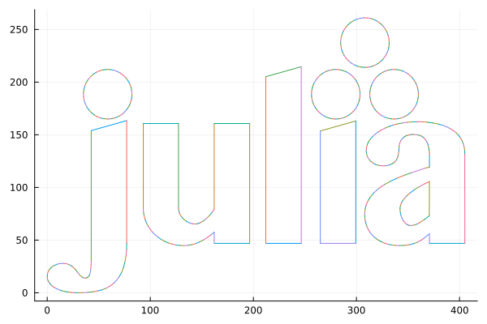

Inkscape.jl
================
JG Pardyak
2023-09-15

[](https://github.com/JacekPardyak/Inkscape.jl/actions/workflows/CI.yml?query=branch%3Amaster)

Inkscape.jl is a Julia wrapper for [Inkscape](https://inkscape.org/).

## Installation

Add the package with

``` julia
import Pkg; Pkg.add(url="https://github.com/JacekPardyak/Inkscape.jl.git")
```

Installation of Inkscape can be performed with

``` julia
inx_install()
```

## Usage

The module allows you to use Inkscape extensions and actions as
described in <https://wiki.inkscape.org/wiki/Using_the_Command_Line>
with functions

``` julia
inx_extension(input, extension, ext)
```

``` julia
inx_actions(input, actions, ext)
```

`input` is an input file path or url

`extension` is an extension from over 100 available. Full list
<https://jacekpardyak.github.io/inkscape.jl/>

`actions` is any logical sequence of actions from over 1000 available.
Full list <https://jacekpardyak.github.io/inkscape.jl/>

`ext` is an extension of the output file from over 20 available. Full
list
<https://inkscape.org/learn/faq/#what-formats-can-inkscape-importexport>

## Advanced usage

In this example, Julia’s downloaded `SVG` logo is enlarged 10 times and
converted to `DXF` in Inkscape to be read by the `ArchGDAL` module and
finally plotted using `Plots`.

``` julia
using Pipe, ArchGDAL, Inkscape, DataFrames, Plots

@pipe "https://upload.wikimedia.org/wikipedia/commons/1/1f/Julia_Programming_Language_Logo.svg" |>
  inx_actions(_, "file-open;select-all;transform-scale:10;page-fit-to-selection;", ".svg") |>
  inx_extension(_, "dxf12_outlines.py", ".dxf") |>
  ArchGDAL.read(_) |>
  ArchGDAL.getlayer(_, 0) |>
  DataFrame(_) |>
  _.""  |> plot
```

    ## Plot{Plots.GRBackend() n=503}

``` julia
savefig("./figures/output.png")
```

    ## "C:\\Users\\jacek\\OneDrive\\Documents\\Inkscape.jl\\figures\\output.png"



The above chain can be extended to create a `SHP` polygons and plot them
with `Luxor` : <https://jacekpardyak.github.io/inkscape.jl/>.

## In the other direction

If you use Inkscape more often than Julia you can try my Inkscape
extensions <https://github.com/JacekPardyak/r-py-jl-inkscape>
